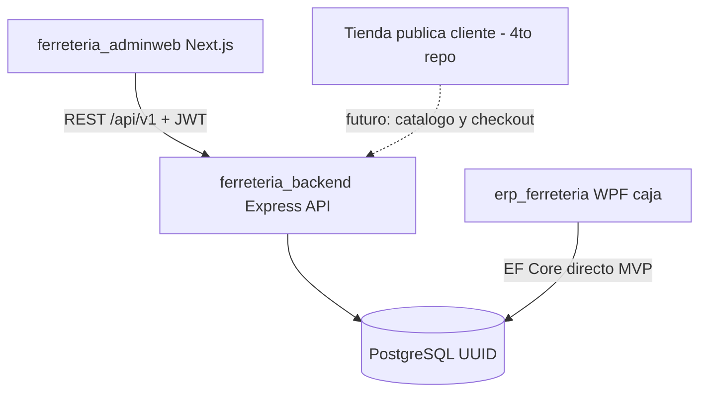

# Plan de construcción — `ferreteria_backend` (API administrativa)

> **Estado:** borrador de plan (listo para implementar por fases)  
> **Fecha:** 2026-07-14  
> **Repos:** `ferreteria_backend`  
> **Consumidor principal:** `ferreteria_adminweb`  
> **BD compartida:** misma PostgreSQL que `erp_ferreteria` (caja WPF)  
> **Documento de estado previo:** [`estado_ferreteria_backend_779de8a2.plan.md`](./estado_ferreteria_backend_779de8a2.plan.md)  
> **Fuente técnica:** [`../../ferreteria_backend/README.md`](../../ferreteria_backend/README.md)

---

## 1. Veredicto actual

Hoy **no hay API HTTP** en `ferreteria_backend`.

| Existe | No existe |
|---|---|
| `prisma/schema.prisma` v3.0 (~45 modelos) | Carpeta `src/` |
| `prisma/seed.ts` | Express / rutas `/api/v1` |
| Docker PostgreSQL (`:55432`) + `database/init.sql` | Auth JWT, Zod, middlewares |
| Scripts npm solo de Prisma/Docker | `tsconfig.json`, `npm run dev` / `start` |

La capa de datos está lista. Lo que falta es el **servidor REST** que expondrá el apartado privado/admin.

---

## 2. Qué se va a construir

API REST Node.js (**Express 5 + Prisma 6 + TypeScript**) en `ferreteria_backend`, versionada bajo `/api/v1/`, que centraliza la lógica administrativa que la caja WPF no implementa.

### Responsabilidades de este repo

- Login administrativo (`system.WebUsers`) con JWT
- RRHH: empleados, bancos, expediente documental, PIN hasheado
- Inventario administrativo: entradas, ajustes, Kardex, alertas
- Compras: proveedores, órdenes de compra, recepción, costo promedio
- Planilla: periodos, corridas, Excel/PDF (referencia `beraka-core-api`)
- Fiscal: libros de IVA, consulta DTE (sin exponer certificados)
- Dashboard BI y reportes
- Import/export Excel (solo en backend)

### Fuera de alcance de este plan (otros repos)

| Repo | Rol |
|---|---|
| `erp_ferreteria` | Caja WPF: ventas, DTE, impresión, PIN de caja — escribe **directo** a PostgreSQL en MVP |
| `ferreteria_adminweb` | UI Next.js del panel privado — consume esta API |
| Tienda pública cliente (4.º repo, futuro) | Compras B2C — **no implementada aún**; se documenta como consumidor futuro de endpoints públicos/catálogo |

---

## 3. Ecosistema objetivo



| Consumidor | Estado en docs | En este plan |
|---|---|---|
| `ferreteria_adminweb` | Documentado | Cliente principal; contrato `/api/v1` |
| Tienda pública | No documentada antes | Reservar módulos públicos futuros; **no construir en Fases 8–11** |
| Caja WPF | Documentado | Comparte BD; no consume la API en MVP |

---

## 4. Stack y convenciones

| Tecnología | Uso |
|---|---|
| Node.js 22+ | Runtime |
| Express 5 | HTTP `/api/v1/` |
| Prisma 6 | ORM (schema ya existente) |
| Zod | Validación de entradas |
| JWT + bcrypt | Auth admin / hash de PINs |
| ExcelJS + PDFKit | Exportes planilla |
| TypeScript 5.x | Lenguaje |

### Reglas obligatorias

- Toda entrada HTTP validada con Zod antes de Prisma
- JWT obligatorio excepto `POST /api/v1/auth/login`
- Roles: `ADMIN`, `ACCOUNTANT`, `OWNER`
- PIN de empleado: hashear aquí; **nunca** devolver hash al cliente
- Inventario y compras en **transacciones Prisma**
- Errores consistentes: `code`, `message`, `details`, `requestId`
- No exponer `DteConfig.CertificateKey` ni secretos

### Puerto local

- API: `http://localhost:3001` → prefijo `/api/v1`
- Admin web ya usa `NEXT_PUBLIC_API_URL=http://localhost:3001/api/v1`

---

## 5. Estructura objetivo

```
ferreteria_backend/
├── package.json              # + scripts dev/start/build
├── tsconfig.json
├── .env.example              # + PORT, JWT_SECRET, CORS_ORIGIN
├── prisma/                   # ✅ ya existe
├── database/                 # ✅ ya existe
└── src/
    ├── server.ts
    ├── app.ts
    ├── config/
    ├── modules/
    │   ├── auth/
    │   ├── employees/
    │   ├── products/
    │   ├── customers/
    │   ├── inventory/
    │   ├── purchasing/
    │   ├── payroll-runs/
    │   ├── fiscal/
    │   ├── dashboard/
    │   └── ...
    ├── middleware/
    ├── lib/                  # prisma client, errors, jwt
    └── schemas/              # Zod
```

Cada módulo tipico: `*.routes.ts`, `*.controller.ts`, `*.service.ts`, `*.schema.ts`.

---

## 6. Roadmap de implementación

### Fase 8 — Scaffold + auth + CRUD base (prioridad 1)

**Entregables**

1. `tsconfig.json`, dependencias Express/Zod/JWT/bcrypt/cors/helmet
2. `src/app.ts` + `src/server.ts` con health check `GET /health`
3. Middleware: auth JWT, roles, error handler, `requestId`
4. Módulo `auth`: `POST /api/v1/auth/login`, `GET /api/v1/auth/me`
5. CRUD: `employees`, `banks`, `document-types`, cuentas/docs de empleado
6. CRUD: `customers`, `products` (catálogo básico)
7. Variables en `.env.example`: `PORT`, `JWT_SECRET`, `CORS_ORIGIN`, `DATABASE_URL`
8. Scripts: `dev`, `build`, `start`

**Criterio de hecho**

- `npm run dev` levanta API en `:3001`
- Login admin contra `WebUsers` (o seed de usuario web si falta)
- Adminweb puede apuntar a `NEXT_PUBLIC_API_URL` y autenticarse

---

### Fase 9 — Inventario administrativo

**Entregables**

- `POST/GET /api/v1/inventory` — entradas, ajustes, listado de movimientos
- Alertas de stock (`StockAlert`)
- Import Excel catálogo/entradas (`/api/v1/import`)

**Criterio de hecho**

- Movimientos actualizan stock en transacción
- Kardex consultable por producto

---

### Fase 9b — Compras

**Entregables**

- CRUD `suppliers`
- Órdenes de compra: `BORRADOR` → `CONFIRMADA` → `RECIBIDA` / `CANCELADA`
- Al recibir: stock + **costo promedio ponderado** en `Product.costPrice`

---

### Fase 10 — Planilla y RRHH avanzado

**Entregables**

- Periodos y corridas (`payroll/periods`, `payroll/runs`)
- Cálculo legal AFP/ISSS/ISR (portar de `beraka-core-api`)
- Export Excel multi-hoja + PDF comprobantes
- Aguinaldo, vacaciones/permisos, liquidaciones (10b/10c)

---

### Fase 10d — Fiscal

**Entregables**

- Libros de IVA desde DTEs y compras
- Consulta DTE sin exponer certificados

---

### Fase 11 — Dashboard BI

**Entregables**

- `/api/v1/dashboard` — KPIs ventas, inventario, compras, RRHH
- Endpoints de reportes generales

---

### Futuro (fuera de Fases 8–11) — Tienda pública

Cuando exista el 4.º repo:

- Endpoints públicos de catálogo (solo lectura, sin JWT admin)
- Flujo de carrito/checkout / órdenes web (definir si escribe en `sales` o esquema aparte)
- Auth de cliente final (separada de `WebUsers`)

No se implementa en este plan; solo se reserva el contrato para no acoplar el admin a supuestos B2C.

---

## 7. Orden de trabajo recomendado (primer sprint)

1. Scaffold TypeScript + Express + health
2. Prisma client compartido en `src/lib/prisma.ts`
3. Auth JWT + seed/`WebUser` de desarrollo
4. Employees + customers + products (lectura/escritura mínima)
5. Documentar contrato OpenAPI o tabla de endpoints en el README del backend
6. Conectar una pantalla real de `ferreteria_adminweb` (login) como smoke test

---

## 8. Riesgos y notas

| Riesgo | Mitigación |
|---|---|
| Credenciales Docker vs `.env.example` inconsistentes | Unificar `ferreteria_user` / BD `ferreteria` (o alinear compose) antes de Fase 8 |
| WPF y API escribiendo las mismas tablas | Transacciones y mismas reglas de stock/costo; no duplicar lógica contradictoria |
| Migraciones Prisma vacías | Seguir con `db:push` en dev; congelar migraciones antes de staging/prod |
| Tienda pública prematura | No mezclar endpoints B2C en Fase 8; mantener JWT admin estricto |

---

## 9. Definición de “listo” por capa

| Capa | Listo cuando… |
|---|---|
| Datos | Schema + seed + Docker (✅ hoy) |
| API mínima (Fase 8) | Login + CRUD empleados/clientes/productos + CORS hacia adminweb |
| API operativa | Inventario + compras transaccionales |
| API completa admin | Planilla + IVA + dashboard |
| Ecosistema web completo | Adminweb consumiendo API + (futuro) tienda pública |

---

## 10. Próximo paso

Al aprobar este plan, **empezar por Fase 8** en `ferreteria_backend` sin tocar aún la tienda pública ni la caja WPF.
