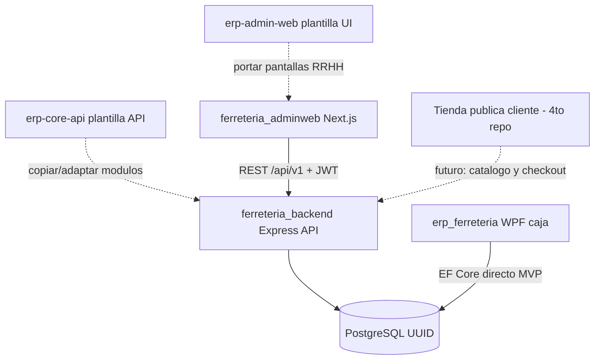

# Plan de construcción — `ferreteria_backend` (API administrativa)

> **Estado:** Fases 8–11 + refinamiento 8b ampliado (ficha/RRHH/clientes/edición planilla); futuro: tienda pública  
> **Fecha:** 2026-07-14  
> **Repos:** `ferreteria_backend`  
> **Consumidor principal:** `ferreteria_adminweb`  
> **BD compartida:** misma PostgreSQL que `erp_ferreteria` (caja WPF)  
> **Documento de estado previo:** [`estado_ferreteria_backend_779de8a2.plan.md`](./estado_ferreteria_backend_779de8a2.plan.md)  
> **Fuente técnica:** [`../../ferreteria_backend/README.md`](../../ferreteria_backend/README.md)

### Plantillas de referencia (proyectos propios)

| Proyecto | Ruta local | Uso en ferreteria |
|---|---|---|
| **erp-core-api** | `C:\Users\lenny\Documents\ERP\erp-core-api` | Plantilla de API: Express + Prisma + auth + motor RRHH/planilla SV |
| **erp-admin-web** | `C:\Users\lenny\Documents\ERP\erp-admin-web` | Plantilla UI: pantallas RRHH/planilla para portar a `ferreteria_adminweb` |

> **Nota:** referencias antiguas a `beraka-core-api` se sustituyen por **`erp-core-api`** (es el mismo trabajo, nombre correcto del repo).

---

## 1. Veredicto actual

| Capa | Estado |
|---|---|
| Prisma schema + seed + Docker | ✅ |
| API Express `/api/v1` (Fase 8) | ✅ Auth + CRUD base |
| UI RRHH base (8b) | ✅ Directorio + ficha/bancos/docs + catálogos RRHH |
| Inventario admin (Fase 9) | ✅ movimientos + alertas + UI |
| Compras (Fase 9b) | ✅ proveedores + OC + costo promedio + valuación |
| Planilla — motor + períodos + corridas + UI básica (Fase 10 MVP) | ✅ |
| Planilla — exports Excel/PDF (Fase 10-export) | ✅ |
| Planilla — aguinaldo/vacaciones/liquidaciones (Fase 10b/10c) | ✅ |
| Fiscal IVA / Dashboard (Fase 10d / 11) | ✅ |
| Refinamiento: clientes + feriados + edición líneas planilla | ✅ |

La API admin cubre el alcance de Fases 8–11 (MVP) más el cierre de placeholders 8b. Fuera de plan: tienda pública B2C.

---

## 2. Qué se va a construir

API REST Node.js (**Express 5 + Prisma 6 + TypeScript**) en `ferreteria_backend`, versionada bajo `/api/v1/`, que centraliza la lógica administrativa que la caja WPF no implementa.

### Responsabilidades de este repo

- Login administrativo (`system.WebUsers`) con JWT
- RRHH: empleados, bancos, expediente documental, PIN hasheado
- Inventario administrativo: entradas, ajustes, Kardex, alertas
- Compras: proveedores, órdenes de compra, recepción, costo promedio
- Planilla: periodos, corridas, Excel/PDF (**portar de `erp-core-api`**)
- Fiscal: libros de IVA, consulta DTE (sin exponer certificados)
- Dashboard BI y reportes
- Import/export Excel (solo en backend)

### Fuera de alcance de este plan (otros repos)

| Repo | Rol |
|---|---|
| `erp_ferreteria` | Caja WPF: ventas, DTE, impresión, PIN de caja — escribe **directo** a PostgreSQL en MVP |
| `ferreteria_adminweb` | UI Next.js del panel privado — consume esta API; **UI RRHH/planilla se porta desde `erp-admin-web`** |
| Tienda pública cliente (4.º repo, futuro) | Compras B2C — **no implementada aún** |

---

## 3. Ecosistema objetivo



---

## 4. Inventario reutilizable — `erp-core-api`

### Copiar / adaptar (alto valor)

| Pieza | Ruta en erp-core-api | Fase ferreteria |
|---|---|---|
| Infra Express (CORS, helmet, error handler) | `src/app.ts`, `src/server.ts`, `src/shared/` | **8** |
| JWT + bcrypt login | `src/modules/auth/`, `src/shared/jwt.ts` | **8** (simplificar a `WebUsers`; sin RBAC BD completo al inicio) |
| Errores / respuestas JSON | `src/shared/errors.ts`, `api-response.ts` | **8** |
| Validación SV (DUI, NIT, etc.) | `src/shared/validation.ts` | **8** |
| CRUD empleados, bancos, docs, depts, puestos | `src/modules/employees/`, `banks/`, `employee-bank-accounts/`, `employee-documents/`, `departments/`, `positions/`, `required-document-types/` | **8** |
| Motor planilla AFP/ISSS/ISR | `payroll-runs/payroll.calculator.ts`, `payroll.builder.ts`, `payroll.constants.ts` | **10** |
| Orquestación corridas | `payroll-runs/payroll-runs.service.ts` | **10** |
| Export Excel/PDF | `payroll-runs/payroll-exports.service.ts` | **10** |
| Periodos, aguinaldo, ISR brackets | `payroll-periods/`, `aguinaldo/`, `isr-brackets/` | **10 / 10b** |
| Vacaciones / permisos / liquidaciones | `leave-*`, `vacation-balances/`, `employee-terminations/` | **10b / 10c** |

### Omitir (no aplica a ferreteria)

- Hotel: `rooms`, `reservations`, `hotel-*`, `customers` (huéspedes)
- Pasantías: `internship-*`, `intern-requests`
- `work-certificates` / DOCX (salvo requisito explícito)
- `public/` (API pública hotel)
- Schemas inventory/billing de erp-core (ferreteria ya tiene Prisma v3 propio)
- Auth con refresh tokens + RBAC por permisos en BD: **simplificar** a roles `ADMIN` \| `ACCOUNTANT` \| `OWNER` en `WebUser.role` (MVP)

### Reglas al portar

1. Prefijo `/api/*` → `/api/v1/*`
2. Mapear a modelos de `ferreteria_backend/prisma/schema.prisma` (no copiar schema Prisma de erp-core)
3. Login contra `system.WebUsers` (no `User` + `Role` de erp-core)
4. PIN de caja: hashear con bcrypt; nunca devolver `pinHash`
5. Portar primero motor (`calculator` + `builder` + `service`); exports Excel/PDF después

---

## 5. Inventario reutilizable — `erp-admin-web`

### Prioridad 1 — pantallas a portar a `ferreteria_adminweb`

| Destino ferreteria | Plantilla erp-admin-web | Cuándo |
|---|---|---|
| `/empleados` | `empleados/directorio/directorio-content.tsx` | Tras Fase 8 API |
| `/empleados/[id]/ficha` | `empleados/ficha/` | Tras Fase 8 |
| `/empleados/[id]/bancos` | `empleados/bancos/` | Tras Fase 8 |
| `/empleados/[id]/documentos` | `empleados/documentos/` | Tras Fase 8 |
| `/rrhh/bancos`, tipos-doc, feriados | `configuracion/bancos|tipos-documentos|feriados` | Tras Fase 8 |
| `/planilla/periodos` | `planilla/periodos/` | Fase 10 |
| `/planilla/corridas` | `planilla/generar/generar-content.tsx` | Fase 10 |
| `/planilla/aguinaldo` | `planilla/aguinaldo/` | Fase 10b |
| `/planilla/vacaciones` | `planilla/vacaciones/` | Fase 10b |
| `/planilla/liquidaciones` | `empleados/liquidaciones/` | Fase 10c |

### Infra UI a portar

- Patrón `lib/api/<entidad>.ts` + hooks React Query
- `AuthGuard` + contexto de sesión
- Tabla / Modal / DatePicker / PageHeader
- Elevación del cliente HTTP de ferreteria (hoy `apiRequest` simple) hacia el patrón de `erp-admin-web` (`ApiClient` + 401)

### Omitir en UI

- Pasantías, constancias Word, salud ocupacional, ISR declaraciones MH (fase inicial)
- Todo el módulo Hotel / Asistencia / Facturación hotel

---

## 6. Stack y convenciones

| Tecnología | Uso |
|---|---|
| Node.js 22+ | Runtime |
| Express 5 | HTTP `/api/v1/` |
| Prisma 6 | ORM (schema ya existente) |
| Zod | Validación de entradas |
| JWT + bcrypt | Auth admin / hash de PINs |
| ExcelJS + PDFKit | Exportes planilla (Fase 10, desde erp-core-api) |
| TypeScript 5.x | Lenguaje |

### Reglas obligatorias

- Toda entrada HTTP validada con Zod antes de Prisma
- JWT obligatorio excepto `POST /api/v1/auth/login` y `GET /health`
- Roles: `ADMIN`, `ACCOUNTANT`, `OWNER`
- PIN de empleado: hashear aquí; **nunca** devolver hash al cliente
- Inventario y compras en **transacciones Prisma**
- Errores consistentes: `success`, `error`/`code`, `message`, `details`
- No exponer `DteConfig.CertificateKey` ni secretos

### Puerto local

- API: `http://localhost:3001` → prefijo `/api/v1`
- Admin web: `NEXT_PUBLIC_API_URL=http://localhost:3001/api/v1`

---

## 7. Estructura objetivo

```
ferreteria_backend/
├── package.json
├── tsconfig.json
├── .env.example
├── prisma/
├── database/
└── src/
    ├── server.ts
    ├── app.ts
    ├── config/
    ├── modules/
    │   ├── auth/
    │   ├── employees/
    │   ├── banks/
    │   ├── products/
    │   ├── customers/
    │   ├── inventory/          # Fase 9
    │   ├── purchasing/         # Fase 9b
    │   ├── payroll-runs/       # Fase 10 ← erp-core-api
    │   ├── fiscal/             # Fase 10d
    │   └── dashboard/          # Fase 11
    ├── middleware/
    ├── lib/
    └── shared/                 # errores, jwt, responses (patrón erp-core-api)
```

Cada módulo: `*.routes.ts`, `*.controller.ts`, `*.service.ts` (+ Zod en controller o `*.schema.ts`).

---

## 8. Roadmap de implementación

### Fase 8 — Scaffold + auth + CRUD base (prioridad 1) — ✅ HECHO

**Plantilla:** `erp-core-api` infra + auth simplificado + CRUD HR/catálogo.

**Entregado**

1. `tsconfig.json`, dependencias Express/Zod/JWT/bcrypt/cors/helmet/tsx
2. `src/app.ts` + `src/server.ts` + `GET /health`
3. Shared: prisma client, errors, jwt, api-response, authenticate, requireRole, errorHandler
4. `POST /api/v1/auth/login`, `GET /api/v1/auth/me` contra `WebUsers`
5. CRUD/list: employees, banks, document-types, departments, positions
6. CRUD: customers, products
7. Seed de `WebUser` admin (`admin` / `admin123`)
8. `.env.example`: `PORT`, `JWT_SECRET`, `CORS_ORIGIN`, `DATABASE_URL`
9. Scripts: `dev`, `build`, `start`

---

### Fase 8b — UI RRHH base en adminweb — ✅ HECHO (MVP)

Portado desde patrones de `erp-admin-web`:

- Login real (`/login`) + `AuthGuard` + sesión
- Cliente API con unwrap `{ success, data }` + token en sessionStorage
- React Query + Sonner
- Directorio `/empleados`: listado, alta/edición, filtros, link a ficha

Pendiente en 8b ampliado: ficha/bancos/documentos con UI completa (aún placeholders).

---

### Fase 9 — Inventario administrativo — ✅ HECHO (MVP)

**Backend** (`/api/v1/inventory`):

- `GET/POST /movements` — listar y crear (ENTRADA_COMPRA, AJUSTE_ENTRADA, AJUSTE_SALIDA) en transacción
- `GET /kardex/:productId` — historial por producto
- `GET /alerts` + `PATCH /alerts/:id/resolve` — stock bajo mínimo
- `POST /import` — importación masiva JSON por código de producto

**Adminweb:** pantalla `/inventario` con formulario de movimiento, alertas y tabla reciente.

Pendiente: import Excel nativo (ExcelJS) y Kardex valorado fino en Fase 9b con compras.

---

### Fase 9b — Compras — ✅ HECHO (MVP)

**Backend:**

- `GET/POST/PATCH /api/v1/suppliers` — maestro proveedores (NIT/NRC, país, crédito)
- `GET/POST/PATCH /api/v1/purchase-orders` — OC con líneas
- `POST .../confirm` | `.../receive` | `.../cancel` — flujo BORRADOR → CONFIRMADA → RECIBIDA | CANCELADA
- Al recibir: `InventoryMovement` `ENTRADA_COMPRA` + stock + **costo promedio ponderado**
- `GET /api/v1/inventory/valuation` — valuación total (stock × costo)
- Kardex con saldo valorado aproximado por movimiento
- Seed: `WebUser` admin vinculado a Employee Administrador

**Adminweb:**

- `/compras/proveedores` — CRUD
- `/compras/ordenes` — crear, confirmar, recibir, cancelar
- `/inventario` — bloque de valuación a costo promedio

---

### Fase 10 — Planilla (portar `erp-core-api`) — ✅ HECHO (MVP)

**Backend** (`ferreteria_backend/src/modules/`):

- `payroll-runs/payroll.{constants,utils,types,calculator,builder,mapper}.ts` — motor AFP/ISSS/ISR/INSAFORP
  portado de `erp-core-api`, adaptado a los modelos `hr.PayrollDetail` de ferreteria (sin desglose de horas
  extra por columna; `overtimeAmount` combinado). Sin lógica de hotel/pasantías.
- `GET/POST/PATCH /api/v1/payroll-periods` + `POST .../close` + `POST .../reopen`
- `GET/POST /api/v1/payroll-runs` (filtros `periodId`/`status`), `GET /:id` con `details[]`
- `POST /api/v1/payroll-runs` genera detalles por empleado activo (excluye `PASANTE`; incluye
  `PLAZO_FIJO`, `TIEMPO_PARCIAL`, `HONORARIOS`) usando permisos aprobados no liquidados del período
- `POST /:id/approve`, `POST /:id/pay`, `POST /:id/void` — máquina de estados `EN_REVISION → APROBADA → PAGADA`
  (o `ANULADA`), en transacción Prisma; totales de `PayrollRun` siempre recalculados desde `PayrollDetail`
- `PATCH /payroll-runs/details/:id` — edita horas extra/bonos/deducciones y recalcula la línea + totales
- Seed: tabla `IsrBracket` 2026 mensual/quincenal (base exenta $550/$275, reforma abr-2025 vigente)

**Adminweb** (`src/app/(admin)/planilla/`):

- `src/lib/api/payroll.ts` + `src/hooks/use-payroll.ts`
- `/planilla/periodos` — listar, crear, editar, cerrar/reabrir período
- `/planilla/corridas` — listar (filtro período/estado), generar corrida, aprobar, pagar, anular, ver
  detalle de líneas por empleado

**Pendiente (siguientes fases):**

- Edición de horas extra/bonos por línea vía UI (hoy solo backend `PATCH .../details/:id`)
- Honorarios: Excel/PDF de retención (export avanzado)

---

### Fase 10-export — Excel/PDF — ✅ HECHO (MVP)

- `GET /api/v1/payroll-runs/:id/export/excel` — detalle por empleado + totales
- `GET .../export/receipts-pdf` — boletas multi-página (PDFKit)
- `GET .../export/planilla-unica` — Excel AFP/ISSS
- Adminweb: `/planilla/corridas/[id]/export` + botón Exportar en listado
- Deps: `exceljs`, `pdfkit`; env `COMPANY_NAME` / `COMPANY_NIT` / `COMPANY_ADDRESS`

---

### Fase 10b/10c — Aguinaldo, vacaciones, liquidaciones — ✅ HECHO (MVP)

**Backend:**

- `/api/v1/aguinaldo` — generar/aprobar/pagar/anular (días 15/19/21 × diario; ISR exento $600)
- `/api/v1/vacation-balances` + `ensure`; `/api/v1/leave-types`; `/api/v1/leave-requests` (aprobar vacaciones descuenta saldo)
- `/api/v1/employee-terminations` — indemnización solo `DESPIDO_INJUSTIFICADO` (30 d/año); vacaciones + aguinaldo proporcional; desactiva empleado al aprobar
- Seed: `LeaveTypes` básicos

**Adminweb:** `/planilla/aguinaldo`, `/planilla/vacaciones`, `/planilla/liquidaciones`

---

### Fase 10d — Fiscal / Fase 11 — Dashboard — ✅ HECHO (MVP)

**Fiscal (`/api/v1/fiscal`):**

- Libros IVA: `VENTAS_CF` (DTE 01), `VENTAS_CCF` (DTE 03), `COMPRAS` (OC `RECIBIDA`)
- `GET /iva-reports`, `GET /iva-reports/period/:year/:month`, `POST /iva-reports/generate`
- `POST /iva-reports/:id/close` (exige cuadre con live), `GET /iva-reports/:id/export` (Excel)
- `GET /dte` — consulta DTE sin payload/certificados
- Adminweb: `/fiscal/libros-iva` (+ detalle mes)

**Dashboard (`/api/v1/dashboard/summary`):**

- Ventas (hoy/semana/mes, MoM, ticket, top productos, por tipo orden)
- Inventario (valor, bajo mínimo, alertas, movimientos hoy)
- Compras (OC pendientes, total mes, top proveedores)
- RRHH (headcount, docs por vencer, planillas pendientes)
- Adminweb: `/dashboard` con KPIs + gráfica Recharts

---

### Futuro — Tienda pública

Endpoints públicos de catálogo; auth cliente distinta de `WebUsers`. Fuera de Fases 8–11.

---

## 9. Orden de trabajo (siguientes sprints)

1. ~~Fases 8–11~~ → **Siguiente (fuera de este plan):** tienda pública / refinamientos (edición horas en UI planilla, exports honorarios, Excel por sección dashboard)

---

## 10. Riesgos y notas

| Riesgo | Mitigación |
|---|---|
| Copiar ciego schema/auth de erp-core | Mapear a `WebUsers` + schema ferreteria v3 |
| `payroll-exports.service.ts` (~3000 líneas) | MVP: 3 exports; honorarios PDF avanzado después |
| UI monolítica (`*-content.tsx` 500–1400 líneas) | Portar pantalla a pantalla; no un big-bang |
| WPF y API en mismas tablas | Transacciones y mismas reglas de stock/costo |
| Tienda pública prematura | No mezclar B2C en Fase 8–11 |

---

## 11. Definición de “listo” por capa

| Capa | Listo cuando… |
|---|---|
| Datos | Schema + seed + Docker (✅) |
| API mínima (Fase 8) | Login + CRUD empleados/clientes/productos + CORS (✅) |
| UI RRHH base (8b) | Directorio/bancos/docs portados desde erp-admin-web |
| Compras (9b) | Proveedores + OC + recepción con costo promedio (✅) |
| API planilla (10) | Motor + períodos + corridas + exports + aguinaldo/vacaciones/liquidaciones (✅) |
| Fiscal / Dashboard | Libros IVA + KPIs (✅ 10d/11) |
| Ecosistema web completo | Adminweb + (futuro) tienda pública |

---

## 12. Próximo paso inmediato

**Fuera de Fases 8–11:** tienda pública B2C, o mejoras opcionales (Excel nativo de importaciones, exports honorarios PDF, Excel por sección del dashboard).

### Refinamiento post-11 (hecho)

- Clientes UI (`/clientes`)
- RRHH: bancos, tipos documento, feriados (`/api/v1/holidays`)
- Ficha empleado + cuentas bancarias + documentos
- Edición de líneas de corrida (extras/bonos/deducciones)
- Hub `/reportes` con enlaces a reportes existentes
