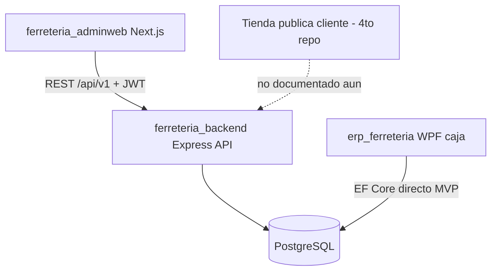

# Estado actual de `ferreteria_backend`

## Respuesta directa

**Sí: hoy no hay backend HTTP funcional.** No existe carpeta `src/`, ni Express, ni rutas `/api/v1`, ni auth JWT. Lo que hay es la **capa de datos** lista para cuando se implemente la API.

## Rol previsto (tu modelo vs. lo documentado)

| Consumidor | En docs actuales | Tu expectativa |
|---|---|---|
| [`ferreteria_adminweb`](ferreteria_adminweb) | Sí — único cliente web documentado | Sí |
| Tienda pública / compras cliente | **No mencionada** en el README | Sí (4to repo) |
| [`erp_ferreteria`](erp_ferreteria) (WPF) | Comparte BD; no consume esta API en MVP | — |

El código del **apartado privado/admin** (auth, RRHH, planilla, inventario admin, compras, IVA, reportes) **sí corresponde a este repositorio**, expuesto como API REST para que `ferreteria_adminweb` la consuma. Una tienda pública B2C encajaría como otro cliente de la misma API (o de endpoints públicos), pero **aún no está en el diseño documentado**.

## Qué hay hoy (real)

- [`prisma/schema.prisma`](ferreteria_backend/prisma/schema.prisma) — esquema v3.0 completo (~45 modelos)
- [`prisma/seed.ts`](ferreteria_backend/prisma/seed.ts) — datos demo
- [`docker-compose.yml`](ferreteria_backend/docker-compose.yml) + [`database/init.sql`](ferreteria_backend/database/init.sql) — PostgreSQL local
- Scripts npm solo de Prisma/Docker (sin `dev`/`start` de servidor)

## Qué falta (API)

Según el README, **Fase 8** pendiente:

- Scaffold Express 5 + TypeScript (`src/`)
- Auth JWT, middlewares, validación Zod
- Módulos: `/api/v1/auth`, employees, products, inventory, payroll, fiscal, etc.

[`ferreteria_adminweb`](ferreteria_adminweb) ya apunta a `http://localhost:3001/api/v1` vía `NEXT_PUBLIC_API_URL` y tiene `apiRequest` en [`src/lib/api.ts`](ferreteria_adminweb/src/lib/api.ts), pero las pantallas aún son placeholders sin llamadas reales.

## Conclusión

Correcto: **este repo es (será) la API central del apartado privado**; el admin web se conectará aquí. Ahora mismo es **modelo de BD + infra**, no un servidor API. La tienda pública para compras de clientes no está especificada todavía en este backend.
